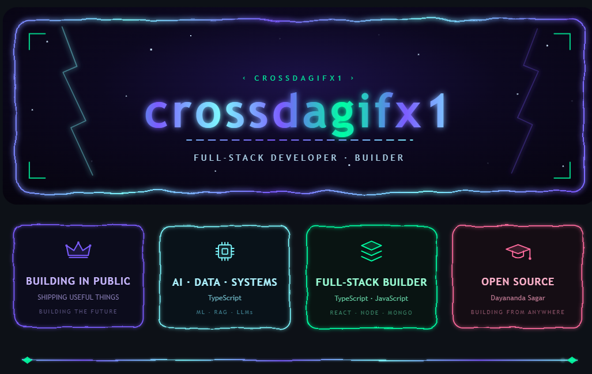

## About me

I’m **Dayananda Sagar**, a full-stack developer and open-source builder focused on shipping useful software, exploring AI and data systems, and building in public.

### What I’m building

| Focus | Description |
|---|---|
| **AI · Data · Systems** | TypeScript, machine learning, RAG, and LLM-powered applications |
| **Full-stack products** | React, Node.js, JavaScript, and MongoDB applications |
| **Open source** | Practical tools, experiments, and reusable developer projects |
| **Building in public** | Sharing useful things and documenting the journey |

### Connect

**BUILDING FROM ANYWHERE · SHIPPING USEFUL THINGS · BUILDING THE FUTURE**

