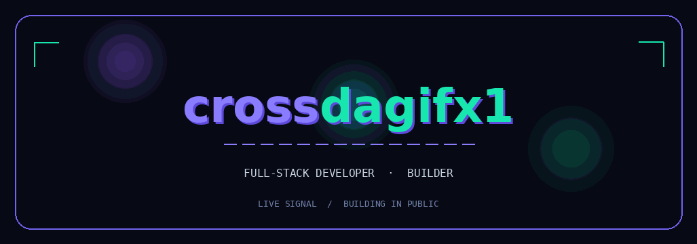

<div align="center">



### `FULL-STACK DEVELOPER` · `BUILDER` · `OPEN-SOURCE CONTRIBUTOR`

`AI · DATA · SYSTEMS`　 `FULL-STACK PRODUCTS`　 `BUILDING IN PUBLIC`

[](https://github.com/crossdagifx1/portfolio)
[](https://github.com/crossdagifx1)

</div>

---

## `01 / SIGNAL`

> I’m **Dayananda Sagar**, a full-stack developer and open-source builder focused on shipping useful software, exploring AI and data systems, and building in public.

I work where **clear interfaces**, **intelligent systems**, and **reliable developer tools** meet. The animated banner above is generated from code and embedded as a looping profile-compatible visual.

## `02 / FOCUS MATRIX`

| `BUILDING IN PUBLIC` | `AI · DATA · SYSTEMS` |
|:---|:---|
| **Shipping useful things**<br />Building the future | **TypeScript · ML · RAG · LLMs** |

| `FULL-STACK BUILDER` | `OPEN SOURCE` |
|:---|:---|
| **React · Node · MongoDB** | **Building from anywhere** |

## `03 / TOOLKIT`

```text
FRONTEND       React · TypeScript · JavaScript · Next.js
BACKEND        Node.js · APIs · PostgreSQL · MongoDB
INTELLIGENCE   RAG · LLMs · Data Systems · Automation
MINDSET        Ship fast · Learn openly · Build useful things
```

## `04 / GITHUB TELEMETRY`

<div align="center">

<a href="https://github.com/crossdagifx1">
  
</a>
<a href="https://github.com/crossdagifx1">
  
</a>

<br />

<a href="https://github.com/crossdagifx1">
  
</a>

</div>

## `05 / CURRENT TRANSMISSION`

I’m building practical software at the intersection of **interfaces, intelligent systems, and developer tools**. Follow the activity signal above or explore the [coded portfolio](https://github.com/crossdagifx1/portfolio).

<div align="center">

`BUILDING FROM ANYWHERE`　·　`SHIPPING USEFUL THINGS`　·　`BUILDING THE FUTURE`

</div>
